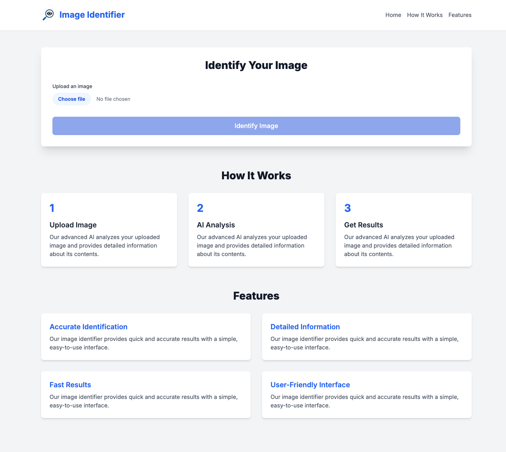
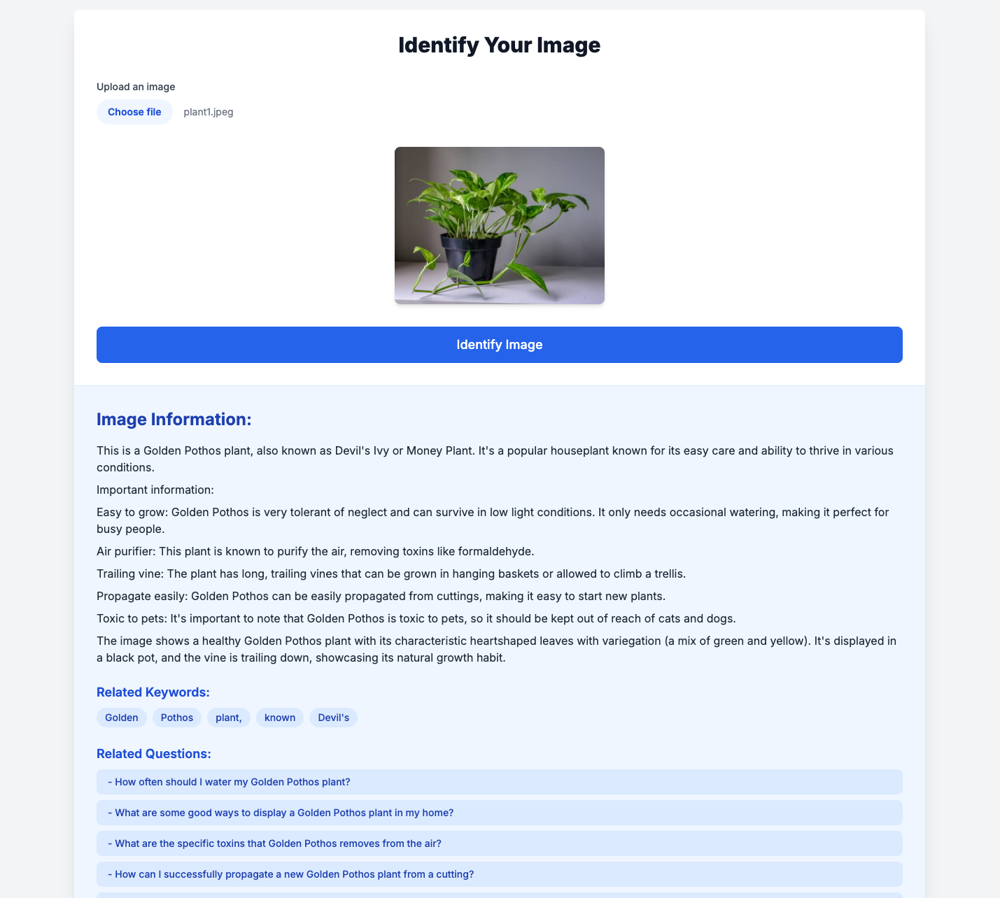

# Image Identifier

## Project Overview

This Image Identifier is a web application built with Next.js that uses Google's Gemini AI to analyze and provide detailed information about uploaded images. The app offers a user-friendly interface for image upload, displays AI-generated information about the image, and provides related keywords and questions for further exploration.

## Features

- Image upload and preview
- AI-powered image analysis using Google Gemini API
- Detailed information display about the identified image
- Related keywords generation for further exploration
- AI-generated related questions about the image
- Responsive design for various screen sizes

## Tech Stack

- Next.js 14 (React framework)
- TypeScript
- Tailwind CSS for styling
- Google Generative AI (Gemini API)

## Key Functionalities

1. **Image Upload**: Users can upload an image through the `ImageUploader` component.
2. **Image Analysis**: The uploaded image is sent to the Gemini AI API for analysis.
3. **Information Display**: The AI-generated information about the image is displayed in the `ResultDisplay` component.
4. **Related Keywords**: The app extracts and displays related keywords from the AI response.
5. **Related Questions**: The app generates and displays related questions about the image using a separate AI query.
6. **Regenerate Content**: Users can click on keywords to regenerate content with a focus on that specific aspect.
7. **Ask Related Questions**: Users can click on generated questions to get more specific information about the image.

## Setup and Installation

1. Clone the repository
2. Install dependencies: `npm install`
3. Set up environment variables:
   - Create a `.env.local` file in the root directory
   - Add your Google Gemini API key: `NEXT_PUBLIC_GOOGLE_GEMINI_API_KEY=your_api_key_here`
4. Run the development server: `npm run dev`
5. Open `http://localhost:3000` in your browser

## Deployment

This project can be easily deployed on platforms like Vercel or Netlify. Make sure to set up the environment variables in your deployment platform's settings.

## Future Improvements

- Implement user authentication for personalized experiences
- Add image categorization and tagging features
- Implement a gallery of previously analyzed images
- Optimize performance for faster image processing
- Add multi-language support for global users

## Contributors

- [Vetrivel Ravi](https://youtube.com/@vetrivelravi)

## License

This project is licensed under the MIT License.

## Landing Page

## After image analysis

